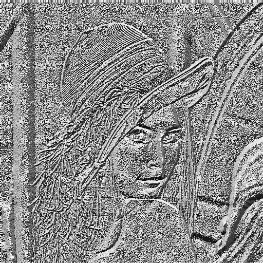
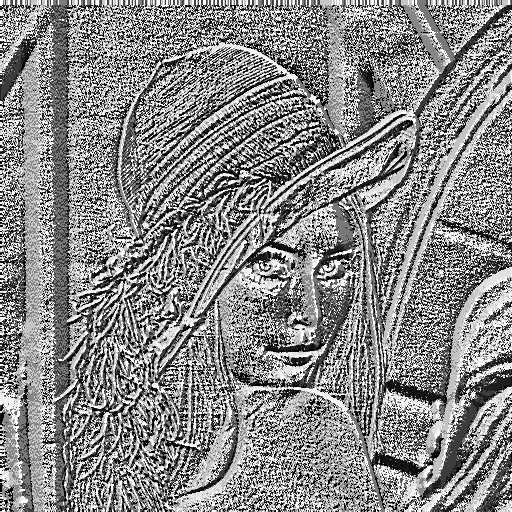
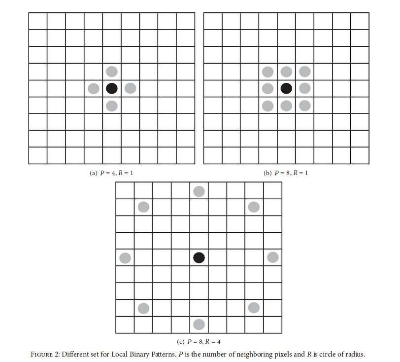

:toc:
# LBP Příznaky

## Plugin
### Základní informace o pluginu
* pro GIMP 2.8
* Python 2 (přestože by Python 3 byl jistě vhodnější variantou, GIMP ho minimálně v této verzi ještě nepodporuje)
* pracuje pouze s obrázky ve stupních šedi
* lze navolit tzv. poloměr/okruh/radius, tedy okolí, pro které bude LBP počítáno
* průběh programu sleduje progress bar


### Instalace
Soubor s pluginem je nutno přesunout do složek, odkud GIMP instaluje při spuštění pluginy (v mém případě _.gimp-2.8/plug-ins_)

### Uživatelská příručka
V horním menu se v záložce Xtns objeví možnost spustit na obrázek _LBP_. Vybráním poloměru a potvrzením dialogového okna se spustí hledání LBP příznaků na daný obrázek. Výsledkem bude nová vrstva s výsledkem. Lze tedy zavolat LBP několikrát s různými poloměry a přímo v GIMPu sledovat rozdíly.


## Ukázky výstupu

### Původní obrázek:


### LBP s poloměrem 1:


### LBP s poloměrem 2:


### LBP s poloměrem 8:


## Implementace

Jakožto programováním pluginů do Gimpu nepolíbená jsem vyšla z ukázkového pluginu HueMapper, kde jsem využila vytváření dialogového okna, načtení obrazových dat a jejich zpětné uložení a zobrazení v nové vrstvě.

Taktéž jsem při psaní využila knihovny NumPy pro několik operací nad polem pro snadnější přístup k vybraným pixelům.


#### Okraje obrázku
Jednou z takových funkcí byla např. _numpy.pad()_, která ohraničí pole/obrázek rámečkem o zvolené šířce a vybraným způsobem. "Mód" tohoto ohraničení může být např. _constant_ pro vyplnění jednou hodnotou, _edge_ pro jakési roztažení rámečku obrázku a _symmetric_ pro vyplnění zrcadlenými hodnotami podél okraje obrázku. Pro tuto implementaci byl zvolen poslední jmenovaný. Další možnosti nechť prozradí pověřenější dokumentace NumPy.
```
#import numpy as np

#create array with mirrored border
dataBorder = np.pad(array=tmp, pad_width=rad, mode='symmetric')

```

#### Výběr okolních pixelů
Pro výběr okolních pixelů jsem zvolila postup vystihující obrázek níže (verze pro osm pixelů).



Při rozšiřování pluginu o možnost zvolit relativně libovolný poloměr bylo využito samé podstaty Pythonu - výřezové notace.

```
#get exactly eight pixels in radius from pixel [x,y]       
src_pixels = dataBorder[x-rad:x+1+rad:rad, y-rad:y+1+rad:rad]                
```

Ač je zápis možná trochu složitý, v Pythonu je běžný. Z pole v Pythonu lze "vyříznout" určitou část. Je k tomu určen zápis:

```
array[ from : to+1 : step ]               
```

Výběrová notace nezahrne do výsledku číslo na druhém místě (označme jako maximum), proto, pokud ho chceme ve výsledku, je nutné maximum navýšit. 
Dále, protože je pole, se kterým plugin pracuje, dvourozměrné, zopakujeme tuto trojici dvakrát, jednou pro vertikální výběr, podruhé pro horizontální.

Pro příklad tedy řekněme, že poloměr zvolíme 2. Chceme tedy vybrat každý druhý řádek s prvním zahrnutým (tedy první, třetí, pátý) a v každém takovém řádku vybrat každý druhý prvek včetně prvního (tedy znovu první, třetí, pátý).
Pro lepší představu viz tabulka níže.

.Příklad pro poloměr = 2 (o - aktuální pixel, x - výběr)
|===
|x | |x | |x
| | | | |
|x | |o | |x
| | | | |
|x | |x | |x

|===

Dále je pole převedeno na jednorozměrné, prvek na pátém místě (index 4) je ten, se kterým jsou okolní porovnávány, a ostatní jsou seřazeny podle indexů, aby byl pro každý pixel zachován jakýsi směr vyhodnocení. Viz kód níže.

```
#get exactly eight pixels in radius from pixel [x,y]                         
src_pixels = dataBorder[x-rad:x+1+rad:rad, y-rad:y+1+rad:rad]                
src_pixels = src_pixels.ravel() #make 2D array 1D 

#get value of the center pixel [x,y]
center = src_pixels[4]
#sequence of indexes
indexesNeeded = [0,1,2,5,8,7,6,3]
```
